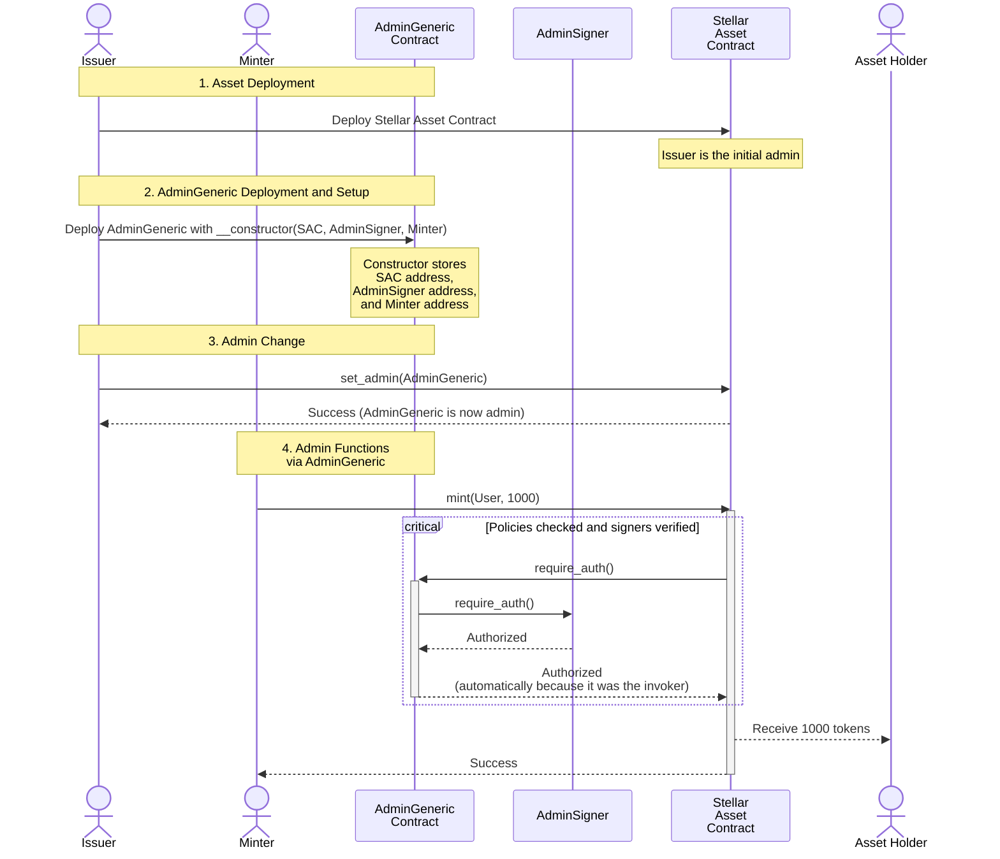

An example flow when a `SACAdminGeneric` contract is set as a new administrator for a Stellar Classic Asset (SAC).

```mermaid
sequenceDiagram
    actor Issuer
    actor Minter
    participant AdminGeneric as AdminGeneric<br/>Contract
    participant AdminSigner
    participant SAC as Stellar<br/>Asset<br/>Contract
    actor User as Asset Holder
    
    Note over Issuer,AdminGeneric: 1. Asset Deployment
    Issuer->>SAC: Deploy Stellar Asset Contract
    Note over SAC: Issuer is the initial admin
    
    Note over Issuer,AdminGeneric: 2. AdminGeneric Deployment and Setup
    Issuer->>AdminGeneric: Deploy AdminGeneric with __constructor(SAC, AdminSigner, Minter)
    Note over AdminGeneric: Constructor stores<br/>SAC address,<br/>AdminSigner address, <br/> and Minter address
    
    Note over Issuer,AdminGeneric: 3. Admin Change
    Issuer->>SAC: set_admin(AdminGeneric)
    SAC-->>Issuer: Success (AdminGeneric is now admin)
    
    Note over Minter,AdminGeneric: 4. Admin Functions<br/>via AdminGeneric
    Minter->>SAC: mint(User, 1000)
    activate SAC
    critical Policies checked and signers verified
    SAC->>+AdminGeneric: require_auth()
    AdminGeneric->>AdminSigner: require_auth()
    AdminSigner-->>AdminGeneric: Authorized
    AdminGeneric-->>-SAC: Authorized<br/>(automatically because it was the invoker)
    end
    SAC-->>User: Receive 1000 tokens
    SAC-->>-Minter: Success
    
```

