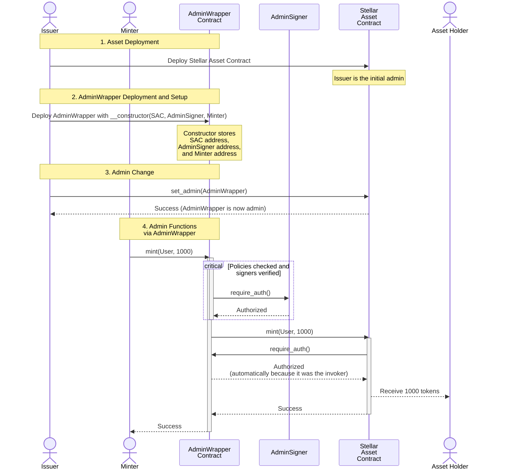

An example flow when a `SACAdminWrapper` contract is set as a new administrator for a Stellar Classic Asset (SAC).

```mermaid
sequenceDiagram
    actor Issuer
    actor Minter
    participant AdminWrapper as AdminWrapper<br/>Contract
    participant AdminSigner
    participant SAC as Stellar<br/>Asset<br/>Contract
    actor User as Asset Holder
    
    Note over Issuer,AdminWrapper: 1. Asset Deployment
    Issuer->>SAC: Deploy Stellar Asset Contract
    Note over SAC: Issuer is the initial admin
    
    Note over Issuer,AdminWrapper: 2. AdminWrapper Deployment and Setup
    Issuer->>AdminWrapper: Deploy AdminWrapper with __constructor(SAC, AdminSigner, Minter)
    Note over AdminWrapper: Constructor stores<br/>SAC address,<br/>AdminSigner address, <br/> and Minter address
    
    Note over Issuer,AdminWrapper: 3. Admin Change
    Issuer->>SAC: set_admin(AdminWrapper)
    SAC-->>Issuer: Success (AdminWrapper is now admin)
    
    Note over Minter,AdminWrapper: 4. Admin Functions<br/>via AdminWrapper
    Minter->>AdminWrapper: mint(User, 1000)
    activate AdminWrapper
    activate AdminWrapper
    critical Policies checked and signers verified
    AdminWrapper->>AdminSigner: require_auth()
    AdminSigner-->>AdminWrapper: Authorized
    end
    deactivate AdminWrapper
    AdminWrapper->>SAC: mint(User, 1000)
    activate SAC
    SAC->>AdminWrapper: require_auth()
    AdminWrapper-->>SAC: Authorized<br/>(automatically because it was the invoker)
    SAC-->>User: Receive 1000 tokens
    SAC-->>AdminWrapper: Success
    deactivate SAC
    AdminWrapper-->>Minter: Success
    deactivate AdminWrapper
    
```
